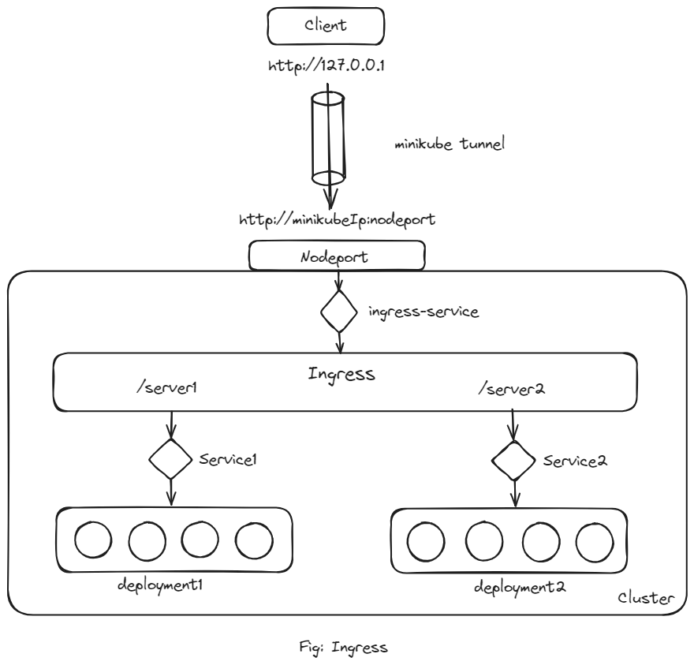

# Ingress on Minikube with the NGINX Ingress Controller

## What is Ingress?

A Kubernetes ingress serves as an API object utilized for overseeing external user access to services hosted within a Kubernetes cluster. It facilitates routing regulations, delineated within the ingress resource, enabling the configuration of cluster access. Typically, the HTTPS/HTTP protocol is employed to facilitate routing.

Operating as a singular entry point into a cluster or service, an ingress streamlines application management and aids in troubleshooting routing issues. Its principal roles encompass traffic load balancing, secure sockets layer (SSL) termination, and name-based virtual hosting.



## What is Ingress Controller

An Ingress controller implements a Kubernetes Ingress and works as a load balancer and reverse proxy entity. It abstracts traffic routing by directing traffic coming towards a Kubernetes platform to the pods inside and load balancing it. The controller’s routing directions come from the Ingress resource configurations.

## How to use NGINX Controller

An NGINX Controller is deployed as a standard deployment within Kubernetes. The deployment file is defined as nginx-ingress-controller, specifying replicas and a basic pod template. It is labeled as nginx-ingress, and the image utilized is nginx-ingress-controller with the appropriate version `nginx-ingress-controller:0.31.1`. This version of NGINX is specifically designed for use as an ingress controller in Kubernetes, thus it has its own specific requirements.

The nginx program within the image is located at `/nginx-ingress-controller`, necessitating this path as the command to initiate the nginx-service. Familiarity with NGINX reveals its array of configuration options, such as log file paths, keep-alive thresholds, SSL settings, and session timeouts. To separate these configuration details from the nginx-controller image, a ConfigMap object must be created and provided. Initially, the ConfigMap object may remain empty, but its creation facilitates future modifications to configuration settings. Any future adjustments can be simply integrated into this ConfigMap object.


Also we need to pass in two environment variables that carry the POD’s name and namespace it is deployed to. The nginx service requires these to read the
configuration data from within the POD. Then we have to specify the ports used by the controller.

After deployment a service `ingress-service` is required to expose the ingress controller to the external world. So we need to creat a service of type NodePort with the nginx-ingress label selector to link the service to the deployment. So with these three objects we should be ready with an ingress controller in its minimal form.

## Why do we need Kubernetes ingress

The ingress resource is recommended when exposing services in production Kubernetes clusters. It is useful when there is a need to define complex traffic routing, and to reduce the cost of external load balancers, leveraging the resources of Kubernetes cluster nodes.

## Steps to run this project locally

1. Clone the repository

```
git clone https://github.com/Konami33/ingress-controller.git
```

2. Create the deployments and services for each server

```
kubectl apply -f deploy1.yaml
```
```
kubectl apply -f deploy2.yaml
```
```
kubectl apply -f service1.yaml
```
```
kubectl apply -f service2.yaml
```

3. Create the deployment, service, configMap and Ingress Resource for Ingress

```
kubectl apply -f ingress-configmap.yaml
```
```
kubectl apply -f ingress-deploy.yaml
```
```
kubectl apply -f ingress-svc.yaml
```
```
kubectl apply -f ingress-resource.yaml
```

4. Check the status of the all the deployments and services

```
kubectl get all
```

5. If all are running properly, create a minikube tunnel.

It must be run in a separate terminal window to keep the LoadBalancer running. Ctrl-C in the terminal can be used to terminate the process at which time the network routes will be cleaned up.

```
minikube tunnel
```

6. Then access these server using:
```
http://127.0.0.1:server1
```
```
http://127.0.0.1:server2
```

## NodePort issue on Minikube for Windows.

In Minikube, NodePort is a commonly used method to expose services to the outside world. It essentially opens a specific port on all nodes within the Kubernetes cluster, allowing external traffic to reach the service. However, when running Minikube on a Windows machine, there are certain networking constraints to consider.

Minikube on Windows operates within a `virtual machine (VM)`, which adds a layer of complexity to the network setup. In a typical Kubernetes cluster, each node has its own IP address, making it straightforward to route traffic to the correct node using NodePort. However, in the case of Minikube on Windows, the VM acts as a single node with its own IP address. This setup can cause issues with routing external traffic to the correct service, as NodePort may not function as expected due to the VM's networking configuration.

To address this issue, Minikube provides a solution called `minikube tunnel`. This command establishes a network tunnel between your local machine and the Minikube VM, effectively bypassing the networking limitations inherent in the virtualized environment. By creating this tunnel, external traffic can reach the services running within the Minikube cluster, allowing NodePort to function properly and enabling seamless access to your applications during development and testing on Windows machines. For further reading.. https://minikube.sigs.k8s.io/docs/handbook/accessing/


